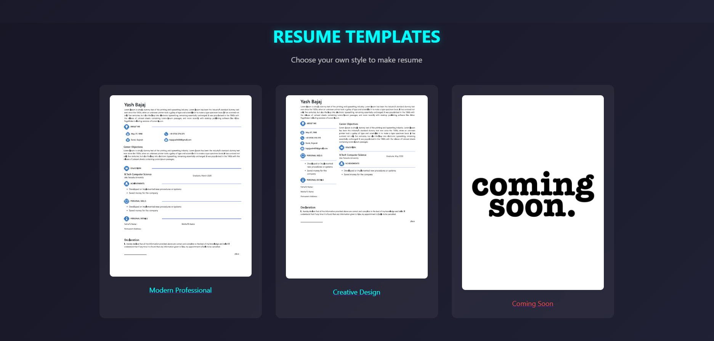

# 📝 Resume Builder

A web application that allows users to create professional resumes using customizable templates and enables recruiters to post job listings and manage applicants.

---

## 🚀 Features

* **User Module**:
  - Build resumes using pre-designed templates.
  - Browse and apply for jobs posted by recruiters.

* **Recruiter Module**:
  - Post new job openings.
  - View and manage candidates who have applied for positions.

---

## 🛠️ Technologies Used

* **Frontend**: HTML, CSS, JavaScript  
* **Backend**: Flask (Python)  
* **Database**: SQL (SQLite)

---

## 📸 Project Interface

Here are some screenshots of the application in action:

### 🔹 Home Page


### 🔹 resume templates


### 🔹 Job Listings (User View)


### 🔹 Post a Job (Recruiter View)


### 🔹 View Candidates (Recruiter Panel)


> 📁 Make sure to place these images inside a folder named `images` in your repository.

---

## 🖥️ Installation & Setup

Follow these steps to set up the project locally:

### 1. Clone the Repository

```bash
git clone https://github.com/Akashdhotre10/Resume-builder.git
cd Resume-builder
```

### 2. Set Up a Virtual Environment

Ensure you have Python 3.x installed.

```bash
python -m venv venv
```

#### Activate the Virtual Environment

* On **Windows**:
  ```bash
  venv\Scripts\activate
  ```
* On **macOS/Linux**:
  ```bash
  source venv/bin/activate
  ```

### 3. Install Required Packages

```bash
pip install flask
```

### 4. Run the Application

```bash
python main.py
```

Visit the app at `http://127.0.0.1:5000` in your browser 🚀

---

## 🤝 Contributing

Contributions are welcome!  
If you'd like to contribute, please **fork** the repository and use a **feature branch**.  
Pull requests are warmly appreciated!

---

## 📄 License

This project is open-source and available under the [MIT License](LICENSE).

---

Made with ❤️ by [Akash Dhotre](https://github.com/Akashdhotre10)

